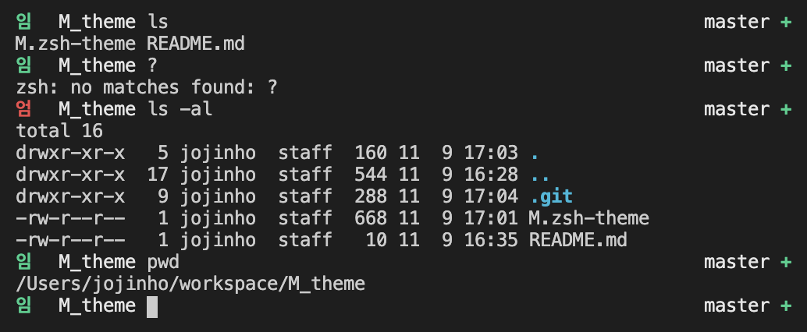

# M theme

Based on [lambda-gitster](https://github.com/ergenekonyigit/lambda-gitster)

## Screenshot



If you do something wrong, you meet a **엄**

## install

has dependency to [oh-my-zsh](https://github.com/robbyrussell/oh-my-zsh)

```
git clone https://github.com/xnBal/M_theme.git
cp M_theme/M.zsh-tmeme ~/.oh-my-zsh/custom/themes/M.zsh-theme
```

and modify to `~/.zshrc` file

```
ZSH_THEME="M"
```

ca use it